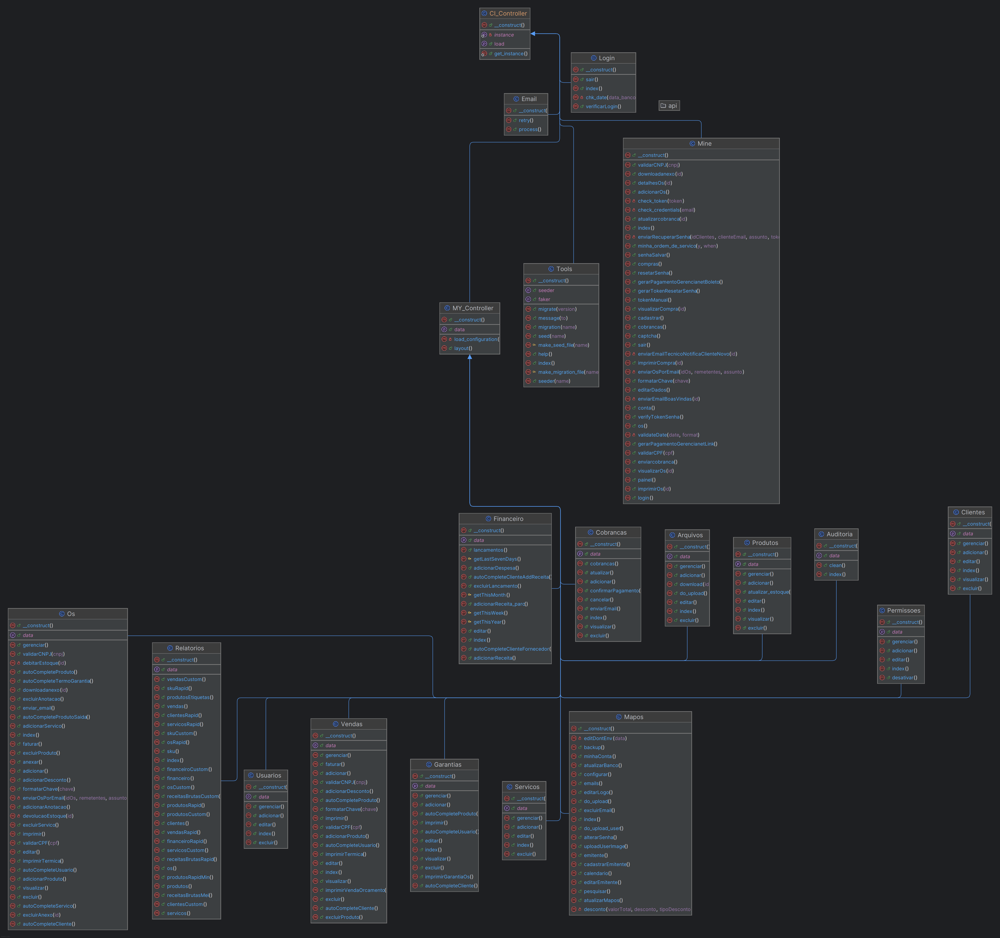
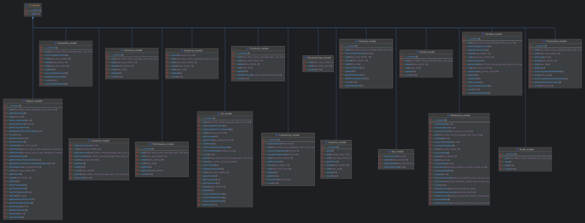
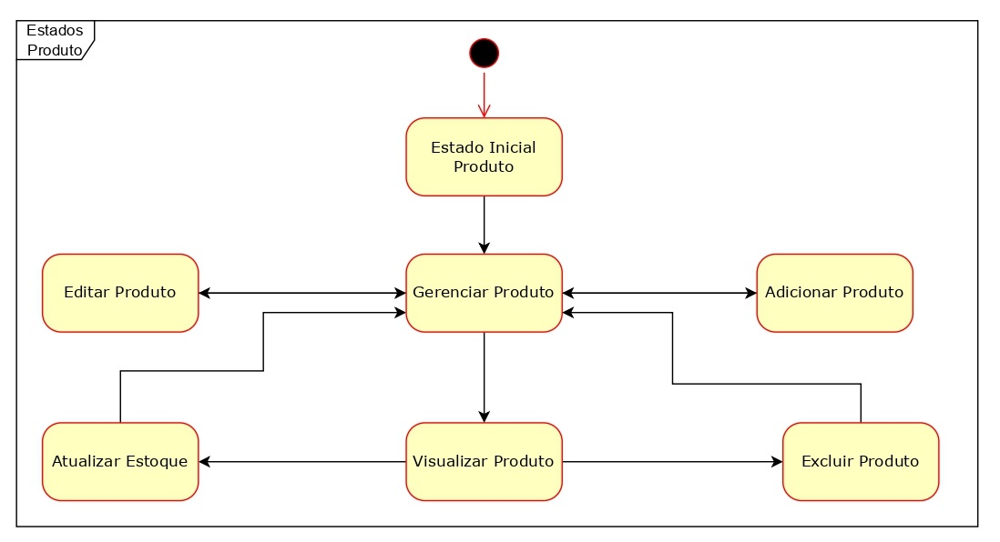
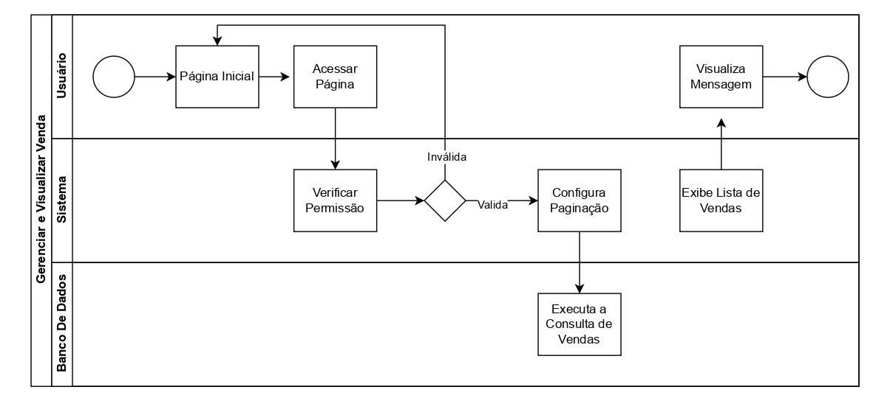
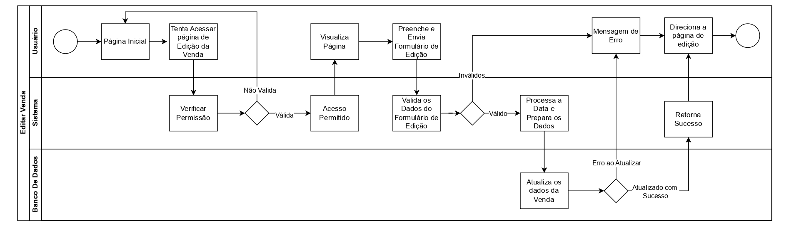
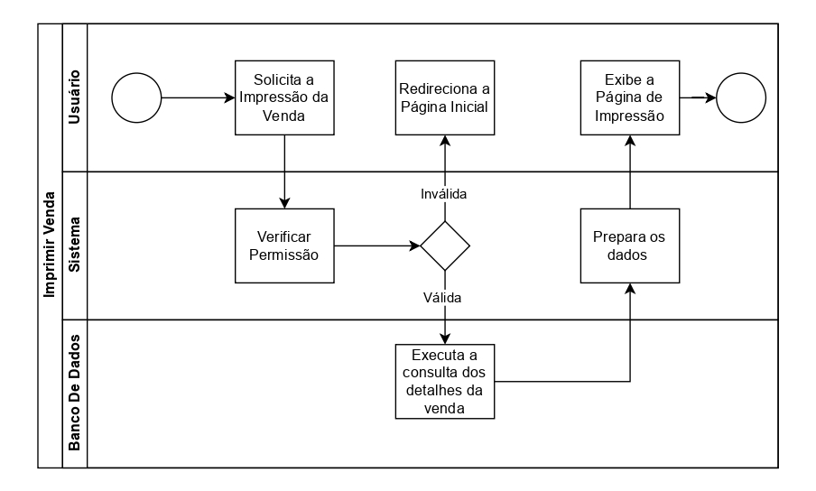

Projeto_2   2348160: Sidney Alexandre Ferracin Junior, 2348012: João Pedro Vaciloto Montilha, 2383969: Marcus Vinícius Molina Freitas

<h2>Análise e Documentação da Arquitetura em Camadas do Sistema Map-OS</h2>

 

Apresentação Map-OS

 

<h3>Estrutura da Documentação</h3>

- [Introdução](#Introdução)
- [Descrição do Sistema](#descrição-do-sistema)
- [Arquitetura do Sistema](#arquitetura-do-sistema)
- [Processos Principais](#processos-principais)
- [Proposta de Melhoria](#proposta-de-melhoria)
- [Conclusão](#conclusão)
- [Referências](#referências)

<h3>Introdução</h3>

    Devido à sua complexidade e abrangência, o Map-OS foi selecionado como objeto de estudo para a documentação detalhada de sua arquitetura, como parte de uma atividade avaliativa da disciplina de Arquitetura de Software na UTFPR de Cornélio Procópio. 
     Essa documentação tem como objetivo explorar e detalhar  os principais processos e recursos presentes em cada camada do sistema, fornecendo uma visão clara e precisa de como a aplicação é estruturada e como seus componentes interagem para atender às necessidades dos usuários.
    O trabalho está dividido em duas seções, onde na primeira (denominada A) nós documentamos e detalhamos a arquitetura do sistema escolhido, apontando com isso os recursos referentes a cada camada e seus principais processos. 
    Já na seção B, nós sugerimos algumas  refatorações e estatégias visando a escalabilidade do projeto.
     A seguir, está uma breve descrição do sistema e sua organização.

<h3>Descrição do Sistema</h3>

    O Map-OS (Manutenção e Automação de Processos de Ordens de Serviço) é um sistema de gestão de ordens de serviço, com uma arquitetura robusta e modular e com uma boa base de usuários ativos e desenvolvedores, se tornando uma ótima escolha de software alvo para documentação de sua arquitetura.
    O objetivo é ser um sistema de assistência técnica, facilitando o gerenciamento da empresa do usuário, o possibilitando realizar sua gestão de ordens e serviços, a gestão de clientes e estoques, geração de relatório sobre as finanças, entre outras funcionalidades. 
     Tendo sido desenvolvido em PHP, ele é um programa de código aberto disponível no GitHub e dividido em uma arquitetura de camadas, o que permite que cada componente do sistema comunique-se com outros de forma clara, faciilitando também sua manutenção. Sua utilização no mercado se da principalmente por pequenas e médias empresas que focam em serviços de atendimento ao cliente.

<h2>Seção A - Arquitetura</h2>

<h3>Arquitetura do Sistema</h3>

A arquitetura do MapOS é organizada nas seguintes camadas: interface do usuário, lógica de negócio, banco de dados e infraestrutura.

  <li><strong>Interface do Usuário (Front-end):</strong> Esta camada é responsável pela interface gráfica do usuário usuário, utilizando o framework <em>Matrix Admin</em>, que oferece componentes pré-configurados, facilitando o desenvolvimento do frontend e tornando sua aplicação atraente e funcional. A interação com os usuários é facilitada também por componentes como Bootstrap, AJAX e jQuery, ferramentas famosas que possibilitam aumentar a funcionalidade e responsividade da interface.</li>
  
 
<ul>

Tela de Login

 

Tela de Principal

 
  
  <li><strong>Lógica de Negócio (Back-end):</strong> A lógica de negócio do Map-OS é o componente central do software, sendo implementada através do framework <em>CodeIgniter</em>. Esta camada se responsabiliza por gerenciar as operações das regras de negócio, como a criação e gerenciamento de ordens de serviço, controle de clientes. Isso permite que o sistema faça a criação e atualização das ordens de serviço, cadastro e gerenciamento dos clientes e os notifica, tanto sobre o status do serviço como marketing e propaganda. Além disso, essa camada também é responsável por realizar a integração com APIs externas, sendo utilizado principalmente para integrar APIs de gateways de pagamento.</li>

 

Diagrama de classes: Controllers

 
  
  <li><strong>Banco de Dados:</strong> O banco de dados, também conhecindo como camada de persistência, é responsável por recuperar e gerenciar o armazenamento de dados do sistema, utilizando o banco de dados MySQL. Entre esses dados estão presentes informações de clientes, ordens de serviço e configurações do sistema. Devido a sensibilidade desses dados, tanto para os clientes como para a empresa, Também está presente nessa camada medidas de segurança como controle de acesso e criptografia dos dados.  As operações de CRUD (Create Read Update Delete) são realizadas nesta camada, que são otimizados no MySQL através do uso de índices.</li>
 

 
Diagrama SQL do Banco de Dados

Diagrama de classes: Models

 
  
  <li><strong>Infraestrutura:</strong> A infraestrutura do Map-OS é projetada visando oferecer um suporte robusto e flexível, possibilitando ser hospedado por servidores web famosos, como Apache e Nginx. Para simplificar a instalação e configuração inicial, foi feito o uso do <em>Composer</em>, que gerencia as dependências para PHP, tais como as bibliotecas e pacotes necessários para seu funcionamento, e opcionalmente <em>Docker</em>, que se utiliza de contêineres para encapsular o sistema, mantendo sua consistência independentemente das configurações do ambiente, ambos garantindo um ambiente de execução estável e replicável.</li>
</ul>

### Processos Principais

A análise dos processos principais do sistema se concentra nos principais fluxos de trabalho que garantem a eficiência operacional e a segurança da plataforma. Esses processos são desenhados para oferecer uma experiência de usuário otimizada e um controle rigoroso das operações comerciais. São eles:

#### Gestão de Ordens de Serviço (OS)
- **Criação e Validação**: O processo inicia com a criação de uma nova ordem de serviço, onde são validadas as informações fornecidas pelo cliente, como CPF e CNPJ. O sistema também valida a possibilidade de entrega do serviço e a viabilidade técnica.
- **Atribuição e Execução**: Técnicos são atribuídos às ordens de serviço e seu status é atualizado ao longo da execução. O sistema oferece funcionalidades para adicionar notas, custos adicionais e monitorar o progresso da OS.
- **Finalização e Feedback**: Após a conclusão do serviço, o cliente é notificado e solicitado a fornecer feedback, o que auxilia na melhoria contínua dos serviços oferecidos. O sistema também oferece a possibilidade de gerar relatórios detalhados sobre as OS finalizadas.

 
Diagrama de classes: Models

#### Gestão de Vendas
- **Geração de Vendas**: O sistema permite a geração de vendas a partir das ordens de serviço ou de outros processos comerciais. São realizadas validações para garantir que todos os requisitos de compra sejam atendidos antes de concluir a venda.
- **Aplicação de Descontos e Termos**: Durante o processo de venda, o sistema gerencia a aplicação de descontos e a adição de termos contratuais específicos, garantindo transparência e conformidade com as políticas comerciais.
- **Visualização e Exportação**: As vendas podem ser visualizadas e exportadas para diferentes formatos, o que facilita a integração com sistemas financeiros e contábeis.

 
Diagrama de Raias: Visualizar Venda

 
Diagrama de Raias: Adicionar Venda

 
Diagrama de Raias: Editar Venda

 
Diagrama de Raias: Imprimir Venda

 
Diagrama de Raias: Deletar Venda

#### Autenticação e Controle de Acesso
- **Login Seguro**: O sistema implementa mecanismos de autenticação, incluindo a verificação de dados bancários, para garantir que apenas usuários autorizados acessem as funções disponíveis.
- **Controle de Acesso por Permissões**: Um modelo de controle de acesso baseado em funções (RBAC) é utilizado para garantir que cada usuário tenha acesso apenas às funções necessárias para seu papel. Logs de atividades são gerados para garantir rastreabilidade.
- **Gestão de Usuários**: A administração de usuários permite a criação, edição e remoção de contas de usuários, com a capacidade de definir níveis de permissão específicos para cada tipo de usuário.

#### Integração com APIs e Ferramentas Externas
- **Integrações de Pagamento**: O sistema se integra com gateways de pagamento para facilitar a cobrança e o processamento de pagamentos das ordens de serviço e vendas realizadas.
- **Ferramentas de Notificação**: Integrações com APIs de comunicação permitem a notificação automática dos clientes sobre o status de suas ordens de serviço, garantindo uma comunicação eficaz e oportuna.
- **Expansão de Funcionalidades**: O sistema é projetado para permitir a adição de novas funcionalidades através de APIs externas, aumentando a adaptabilidade e o valor agregado para o usuário final.

#### Gestão Financeira
- **Controle de Cobranças**: O sistema oferece um módulo robusto para o gerenciamento de cobranças, incluindo a confirmação de pagamentos, emissão de faturas, e controle de inadimplência.
- **Relatórios Financeiros**: Relatórios detalhados podem ser gerados para monitorar o desempenho financeiro, permitindo uma visão clara e estratégica do fluxo de caixa e da saúde financeira da empresa.
- **Integração Bancária**: Funcionalidades para integração com serviços bancários permitem uma gestão eficiente das transações financeiras diretamente pelo sistema.

<h2>Seção B - Proposta de Melhoria</h2>

<h3>Proposta de Melhoria</h3>

Esta seção é responsável por propõe uma estratégia que auxilie em um futuro aumento da escalabilidade e melhoria na arquitetura do Map-OS:

### Implementação da Modularização com Padrão MVC

Recentemente, o sistema foi aprimorado por meio da aplicação de uma estratégia de modularização das classes, integrando-se ao padrão de arquitetura MVC (Model-View-Controller). Essa mudança foi implementada para melhorar a organização do código, facilitar a manutenção e escalar a aplicação de maneira mais eficiente.

#### Mudança Sugerida

Atualmente, o sistema utiliza uma estrutura pouco modular, onde várias classes e funcionalidades estão interligadas de forma direta, resultando em classes grandes com alta complexidade gerando dificuldades por exemplo: Ao tentar gerenciar o código, adicionar novas funcionalidades ou até mesmo corrigir bugs. Afim de solucionar essas questões, nós sugerimos uma proposta da reoganização do sistema, focada em ajustar classes extensas em módulos específicos para que se alinhem ao padrão MVC e SRP. Esta reorganização inclue os seguintes módulos:

 

Modularização do sistema

 

- **Módulo Financeiro**: Responsável pela gestão de cobranças, contas e relatórios financeiros.
- **Módulo Clientes**: Gerencia informações de clientes, incluindo dados de contato e histórico de serviços.
- **Módulo Vendas**: Focado no gerenciamento de vendas e pedidos, desde a criação até a finalização.
- **Módulo Usuários**: Trata da autenticação, controle de acesso e gestão de usuários.
- **Módulo Tools**: Fornece ferramentas e funcionalidades auxiliares que são utilizadas em diversos pontos do sistema.

Nesta proposta, cada módulo foi estruturado de acordo com o padrão MVC, onde cada componente recebeu sua devida responsabilidade de acordo com, os metodos Model, View e Controller, seguindo as seguintes lógicas e responsabilidades definidas:

- **Model**: Lida com a lógica de negócios e a manipulação dos dados.
- **View**: Responsável pela apresentação dos dados ao usuário, seja através de interfaces gráficas ou outros meios.
- **Controller**: Atua como intermediário entre Model e View, processando entradas do usuário, atualizando os Models e, em seguida, fornecendo os dados atualizados à View.

Outra mudança sugerida é a refatoração da classe Mine em outras classes menores, como visto na imagem acima. Essa refatoração foi sugerida, visto em mente, a complexidade e o tamanho da classe Mine, que assumia muitas responsabilidades, indo contra o o princípio da responsabilidade única (SRP), afim de segui-lo foi realizado a refatoração fazendo com que cada classe tenha uma responsabilidade específica dentro do sistema. 

Esse tipo de refatoração traz diversas vantagens, entre as quais se destacam a realização de testes unitários, permitindo que cada parte do sistema seja testada de forma independente tornando os testes mais eficazes, o isolamento das mudanças, facilitando a detecção de bugs e previnindo o surgimento de novos problemas durante a atualização de outras classes, e a modularização, o qual também simplifica o controle de versionamento tornando o histórico de alterações mais claro e facilitando a revisão do código. Essas vantagens, em conjunto, melhoram a qualidade do código, tornando-o mais robusto e flexível para futuras mudanças ou adições.

#### Benefícios da Refatoração em MCV

**Manutenção Facilitada**: Com a modularização organizada em blocos independentes, cada parte do sistema é tratada de forma isolada, o que torna a manutenção muito mais simples e eficaz. Esse modelo permite que futuras atualizações ou correções sejam realizadas em módulos específicos, sem o risco de impactar negativamente outros módulos independentes.

**Escalabilidade**: A estrutura modular auxilia a escabilidade do sistema pois permite que novos módulos sejam adicionados ou até mesmo que módulos ja existentes sejam expandidos de forma eficiente. Essa flexibilidade reduz o impacto de comprometer a estabilidade do sistema, facilitando o seu crescimento conforme as necessidades do sistema aumentam.

**Clareza e Organização**: Com a adoção dessa organização, a clareza do código é aprimorada o que melhora a compreensão do sistema como um todo. Algo de extrema importância para projetos de código aberto, possibilitando que os desenvolvedores entendam facilmente a localização de cada funcionalidade e como os diferentes componentes interagem entre si.

**Alinhamento com Padrões de Mercado**: A adoção do padrão MVC, em conjunto com a modularização, alinha o sistema com práticas recomendadas de desenvolvimento de software, facilitando a integração com outras ferramentas e frameworks, além da adoção de novas tecnologias.

**Testabilidade**: A modularização e o uso do padrão MVC facilitam a criação de testes unitários e de integração. Isso permite que cada módulo seja testado isoladamente, garantindo maior confiabilidade do sistema e facilitando a identificação de bugs.

## Conclusão

A aplicação de modularização, alinhada ao padrão MVC, juntamente com a refatoração da classe Mine, resultará em um sistema mais robusto, organizado e de fácil manutenção. Essas mudanças não apenas aprimoram a eficiência do desenvolvimento atual e de futuras evoluções, mas também preparam o sistema para suportar expansões, correções e integrações futuras de maneira mais ágil e com menor propensão a erros. Além disso, como se trata de um projeto aberto, tais implementações são de suma importância, pois facilitarão o entendimento do código, permitindo que mais colaborações possam surgir.

<h4>Referências</h4>
<ul>
  <li><a href="https://github.com/RamonSilva20/mapos">Repositório Oficial do Map-OS</a></li>
  <li><a href="https://codeigniter.com/userguide3/">Documentação do CodeIgniter</a></li>
  <li><a href="https://dev.mysql.com/doc/">Documentação do MySQL</a></li>
</ul>
